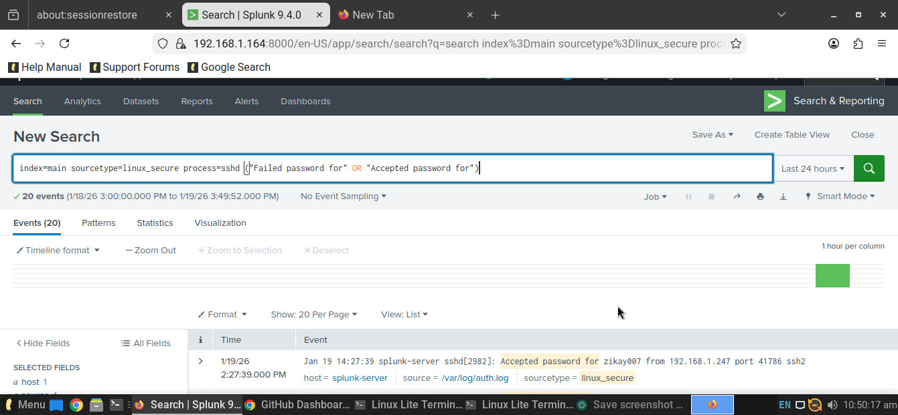
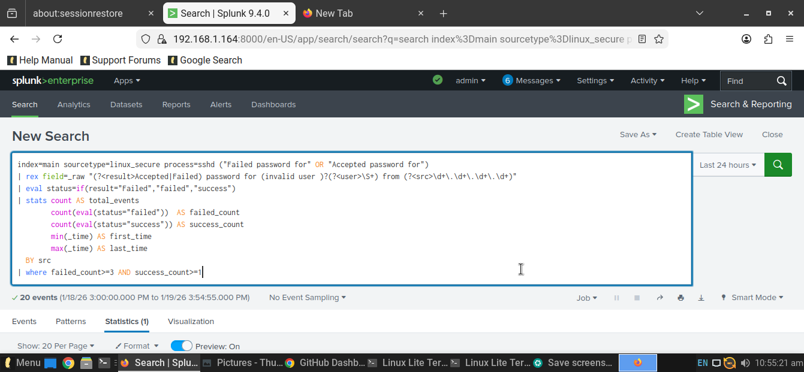

# splunk-ssh-bruteforce-detection

SSH brute-force detection in Splunk using Linux sshd logs. This lab creates a simple SPL rule that reads `linux_secure` auth logs, separates failed and successful logins, and flags any IP that has several failed SSH password attempts followed by a successful login — a strong sign of a brute-force attack.

## SSH Brute-Force Detection in Splunk

This lab implements a custom detection in Splunk to identify successful SSH brute-force attacks against a Linux host using `linux_secure` sshd logs. The SPL parses authentication events, classifies failed and successful logins, and flags source IPs that generate multiple failed password attempts followed by at least one successful login.

## Detection SPL

```spl
index=main sourcetype=linux_secure process=sshd ("Failed password for" OR "Accepted password for")
| rex field=_raw "(?<result>Accepted|Failed) password for (invalid user )?(?<user>\S+) from (?<src>\d+\.\d+\.\d+\.\d+)"
| eval status=if(result="Failed","failed","success")
| stats count AS total_events
        count(eval(status="failed"))  AS failed_count
        count(eval(status="success")) AS success_count
        min(_time) AS first_time
        max(_time) AS last_time
  BY src
| where failed_count>=3 AND success_count>=1
```
## Screenshots



